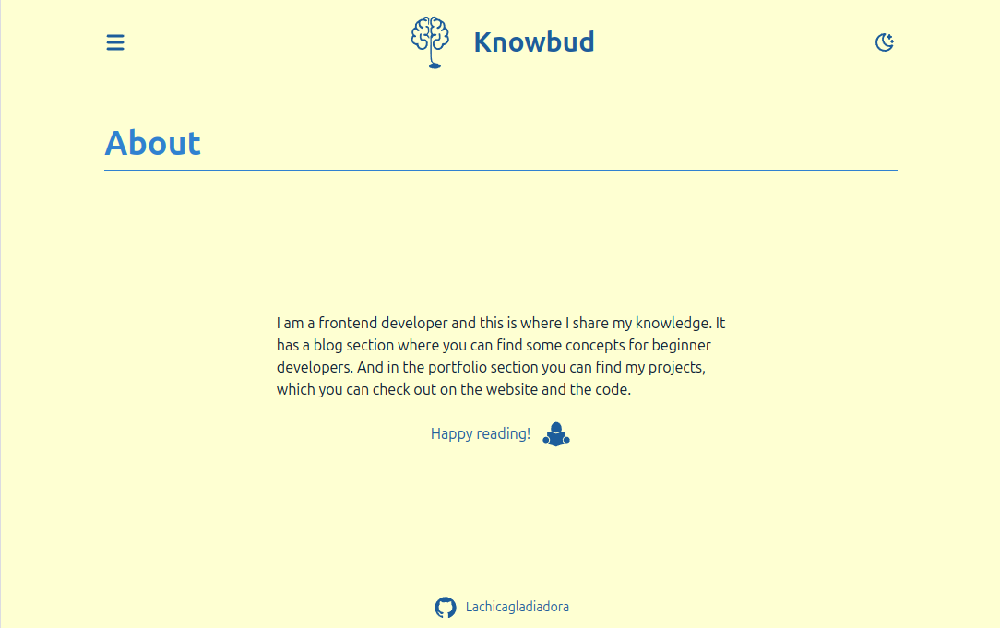

# Knowbud

Website created with Astro, React and TypeScript with the purpose of sharing development concepts and projects mine.



## Features

- Responsive design
- Dark mode
- Immersive

## How to run

To get started, clone the repository and install dependencies:

1. Clone this repository.

```bash
git clone git@github.com:Lachicagladiadora/lcg-knowbud.git
cd lcg-knowbud
code lcg-knowbud
```

2. Run `bun install` to install the dependencies.
3. Run `bun run dev` to run the server so you can enjoy the viewing.

## Collaborations

If you would like to contribute, please fork and then PR
